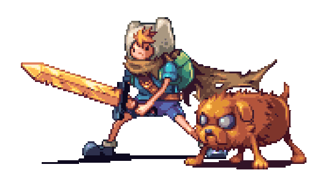

### Hi there, I'm Ivan Vasiliev 👋🏻

  

    👨‍💻 I'm a full-stack developer who enjoys learning new languages and frameworks. I'm currently learning: 
  

   
  

    
    
     
    
    
    
    
    
    
    
    
    
    
    
    
    
    
    
    
    
    
    
    
    
    
  

  
📈 My Stats: 

   
  

     
      
     
      
      
     

        

          
           &nbsp;
          
        

     

  

  
🌐 My Personal Website / Additional links: 

   
  

    <!-- target="_blank" does not work for GitHub's README.md -->
    <!--  -->
    Coming soon!
  

  &nbsp;
  &nbsp;
  

    
    
    &nbsp;
    &nbsp;
    
  

  

    💬 Inspirational quotes that keep me motivated to code: 
  

   
  

    

      <i>
        "The key to success in life is having that lifelong passion for learning that extends beyond good grades, test scores, and graduation dates." - M, 2021 🎓
      </i>
    

     
    

      <i>
        "To become a great software developer, you must continuously read, learn, and code." - M, 2022 📚
      </i>
    

     
    

      <i>
        "eat( ); sleep( ); code( ); repeat( );" - M, 2023 🤔
      </i>
    

  

                                                          
<!-- **IvanVasil-ev/IvanVasil-ev** is a ✨ _special_ ✨ repository because its `README.md` (this file) appears on your GitHub profile. -->
